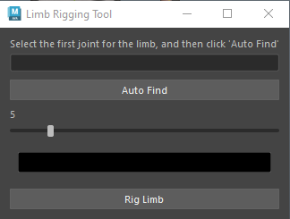

# Maya Plugins

this is a collection of maya plugins to help with rigging and other things

# How to Install

Drag the "install.mel" file into Maya's view port and the tools will appear on the current shelf

## Limb Rigger

Rigs any 3 joint limb
* Automatically finds the selected joints
* Can adjust controller  size
* Can adjust controller color
* Can switch from FK to IK